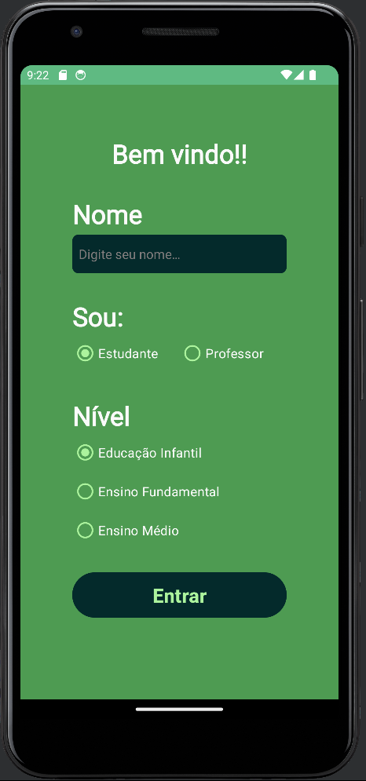
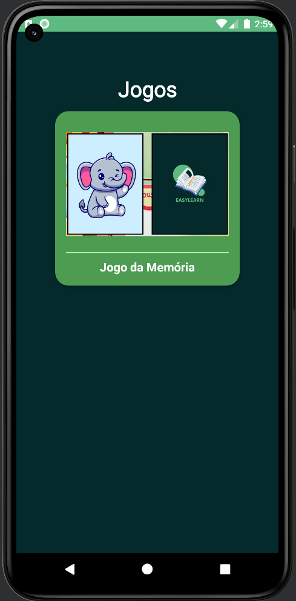
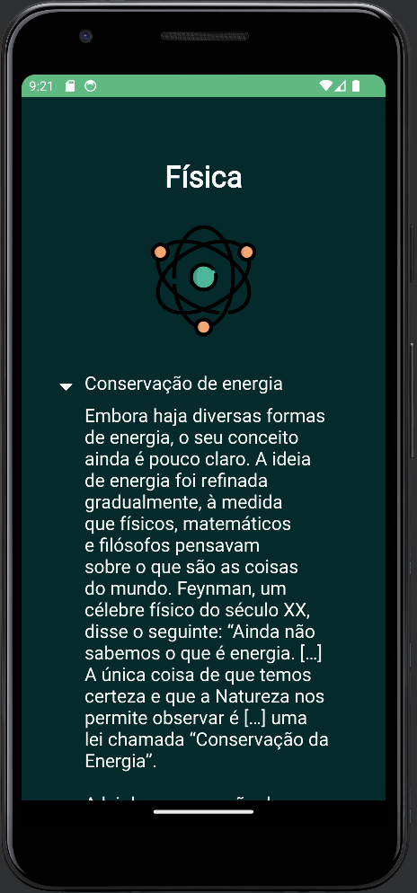
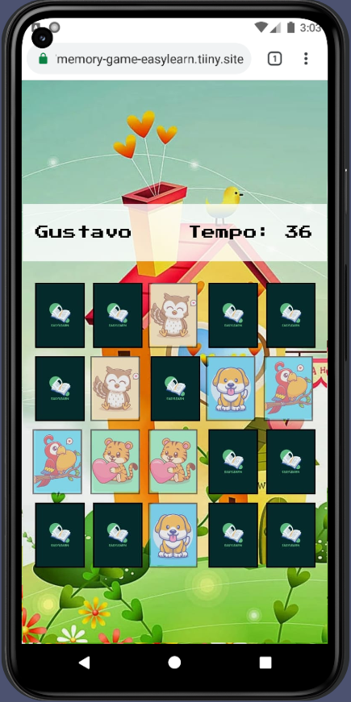

  

 

## 🧪 Technologies

- [Android](https://www.android.com)
- [Kotlin](https://kotlinlang.org)

## 🎯 Description

An Android Kotlin app to help students and teachers.

## 📷 Screenshots

  
  
  
  
  

---

